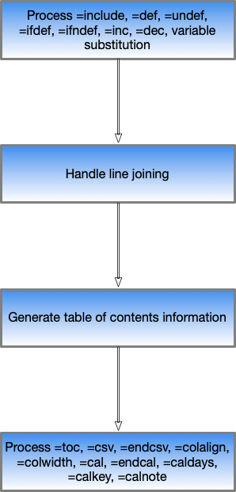

<style>
    .blue {
        color: #0000FF;
    }

    .red {
        color: #FF0000;
    }

    .green {
        color: #00DD00;
    }

    .purple {
        color: #FF00FF;
    }

    .yellow {
        color: #BBBB00;
    }

    .darkgreen {
        color: #008000;
    }

    .orange {
        color: #FFA500
    }

    .turquoise {
        color: #00FFFF
    }

    .C0000C0 {
        color: #0000C0;
    }

    .C00C000 {
        color: #00C000;
    }

    .C00C0C0 {
        color: #00C0C0;
    }

    .CC00000 {
        color: #C00000;
    }

    .CC000C0 {
        color: #C000C0;
    }

    .CC0C000 {
        color: #C0C000;
    }

    .C0000FF {
        color: #0000FF;
    }

    .C00FF00 {
        color: #00FF00;
    }

    .C00FFFF {
        color: #00FFFF;
    }

    .CFF0000 {
        color: #FF0000;
    }

    .CFF00FF {
        color: #FF00FF;
    }

    .CFFFF00 {
        color: #FFFF00;
    }

    .C000080 {
        color: #000080;
    }

    .C008000 {
        color: #008000;
    }

    .C008080 {
        color: #008080;
    }

    .C800000 {
        color: #800000;
    }

    .C800080 {
        color: #800080;
    }

    .C808000 {
        color: #808000;
    }

    .C000000 {
        color: #000000;
    }
</style>


# Markdown Preprocessor User Guide

This document describes the mdpre Markdown preprocessor.

In this document we'll refer to it as "mdpre", pronounced "em dee pree".

This document was converted to HTML at 16&colon;11 on 25 May&comma; 2025.

### Table Of Contents

* [Why A Preprocessor?](#why-a-preprocessor)
* [How Do You Use mdpre?](#how-do-you-use-mdpre)
	* [Help](#help)
	* [Verbose Mode](#verbose-mode)
	* [Creating A Make File Fragment](#creating-a-make-file-fragment)
	* [Defining Variables](#defining-variables)
	* [Filenames](#filenames)
	* [Specifying Filenames On The Command Line](#specifying-filenames-on-the-command-line)
	* [TextBundle And TextPack Support](#textbundle-and-textpack-support)
	* [Processing Flow](#processing-flow)
* [Language Elements](#language-elements)
	* [Including files with `=include`](#including-files-with-include)
	* [Defining Variables With `=def`](#defining-variables-with-def)
	* [Undefining Variables With `=undef`](#undefining-variables-with-undef)
	* [Incrementing Integer Variables Wth `=inc`](#incrementing-integer-variables-wth-inc)
	* [Decrementing Integer Variables Wth `=dec`](#decrementing-integer-variables-wth-dec)
	* [Conditional Inclusion](#conditional-inclusion)
		* [`=ifdef` And `=ifndef`](#ifdef-and-ifndef)
		* [`=ifempty` And `=ifnotempty`](#ifempty-and-ifnotempty)
		* [`=ifmatch` And `=ifnotmatch`](#ifmatch-and-ifnotmatch)
	* [Converting A CSV File To A Markdown Table With `=csv` And `=endcsv`](#converting-a-csv-file-to-a-markdown-table-with-csv-and-endcsv)
		* [Controlling Table Alignment With `=colalign`](#controlling-table-alignment-with-colalign)
		* [Controlling Table Column Widths With `=colwidth`](#controlling-table-column-widths-with-colwidth)
		* [Colouring Whole Rows' Text With `=rowspan`](#colouring-whole-rows-text-with-rowspan)
	* [Creating A Calendar Month Table With `=cal`](#creating-a-calendar-month-table-with-cal)
		* [Controlling How Day Numbers Are Displayed With `=caldays`](#controlling-how-day-numbers-are-displayed-with-caldays)
		* [Adding A Key To The Day Numbers' Styling With `=calkey`](#adding-a-key-to-the-day-numbers-styling-with-calkey)
		* [Adding Information To A Cell With `=calnote`](#adding-information-to-a-cell-with-calnote)
	* [Concatenating Lines With `\`](#concatenating-lines-with)
	* [Generating A Table Of Contents With `=toc`](#generating-a-table-of-contents-with-toc)
	* [Terminating Input With `=stop`](#terminating-input-with-stop)
* [Additional Information](#additional-information)
	* [Built-In Variables](#builtin-variables)

## Why A Preprocessor?

Ask yourself the following questions. Have you ever wanted to

1. create a Markdown document from more than one piece of text?

1. make a Markdown table from a CSV file?

1. control whether text was included or not?

1. use variables in Markdown?

1. have a Table Of Contents automatically generated in Markdown?

1. use version control - such as git?

1. automatically create a make file that gets updated as you add parts to a markdown document?

If you answer "yes" to any of these you need mdpre.

## How Do You Use mdpre?

You write Markdown in exactly the same way as normal, with simple syntax extensions to invoke the additional function.

To use mdpre you need to

1. Download it.
1. Have Python 3 installed - at a reasonably high level.
1. Invoke it.

The following instructions are for Unix-like systems. (It's developed and used by the developer on MacOS and Raspbian.) Windows users will need a slightly different form, but the principle is the same.

Here is a sample invocation:

	mdpre < document.mdp > document.md

In this invocation the document.mdp file is the source and the "vanilla" Markdown produced by mdpre is written to document.md.

You can, of course, use stdin and stdout in a pipeline. Indeed the developer uses this to pipe into another program.

Messages are written to stderr.

### Help

You can get parameter help using the `-h` parameter:

	mdpre -h

### Verbose Mode

If you want more diagnostics turn on "verbose mode", using the `-v` parameter:

	mdpre -v < document.mdp > document.md

This documents most of the major events and decisions, such as the embedding of files, conditional inclusion, and the conversion of CSV data to Markdown tables. One early run of this document with `-v` specified resulted in

	mdpre Markdown Preprocessor v0.1 (17 March, 2018)
	=================================================
	Def TOC = Table Of Contents
	Markdown Preprocessor User Guide
	Table Of Contents - spec '2 * Table Of Contents'
	.....  Why A Preprocessor?
	.....  How Do You Use mdpre?
	..... .....  Help
	..... .....  Verbose Mode
	..... .....  Filenames
	.....  Language Elements
	..... .....  Including files with `=include`
	..... .....  Defining Variables With `=def`
	..... .....  Undefining Variables With `=undef`
	..... .....  Conditional Inclusion With `=ifdef`, `=ifndef`, And `=endif`
	..... .....  Converting A CSV File To A Markdown Table With `=csv` And `=endcsv`
	CSV Start
	CSV Stop
	..... ..... .....  Controlling Table Alignment With `=colalign`
	Column Alignment - spec 'l r r'
	CSV Start
	CSV Stop
	..... ..... .....  Controlling Table Column Widths With `=colwidth`
	..... .....  Concatenating Lines With `\`
	..... .....  Generating A Table Of Contents With `=toc`

	Processing completed.


### Creating A Make File Fragment

If you define a destination for file descriptor 3 mdpre will emit a make file fragment that lists the files used by the document.
For example, coding

	mdpre < document.mdp > document.md 2> document.log 3> fragment.mak

will write all messages to document.log and a make file fragment to fragment.mak.

Here is an example of such a fragment:

	makefragment=
	$(target).md: 
		$(target).mdp \ 
		included.mdp \ 
		processing-Flow.png \ 
		processing-Flow\ 2.png 
	
		mdpre -v < $(target).mdp > $(target).md 2>$(target).log $(makefragment)

You could, for example, include the following lines in your main make file (possibly called "makefile"):

```
target=user-guide

include fragment.mak
```

This would set the make variable `target` to the value "user-guide".
The result of this is that running make invokes mdpre against user-guide.mdp, creating as output user-guide.md and sending messages to user-guide.log.
Verbose Mode is turned on - which is probably what you want with a log file as a destination for messages.

In this use case make includes the list of files the build depends on.

The variable `makefragment` is defined to be the empty string.
You can override this on the command line.
Here is an example:

	make makefragment='3>insert.mak'

The idea here is to allow you to specify a make file fragment is generated.
The default is not to - as it is more likely you won't want to regenerate the make file fragment every time you run mdpre.

### Defining Variables

You can define variables on the command line when you run mdpre. Use the `-d` switch. For example

	mdpre -v -dfred -dbrian < test.mdp > test.md

will set two variables - fred and brian. These can be used with `=ifdef` and `=ifndef` to control processing. See [Conditional Inclusion](#conditional-inclusion) for more.

You can also set their value. For example

	mdpre -v '-djon=bon jovi' < test.mdp > test.md

In this case the whole `-d` parameter string is in quotes to preserve spaces in the value.

### Filenames

You can use any names you like but an extension to denote that the input file is a preprocessable one is handy. In the above example .mdp was used. This seems like a sensible convention.

Similarly, common file extensions for Markdown files are .md and .markdown.

### Specifying Filenames On The Command Line

As well as using stdin, stdout, stderr, and file handle 3 you can specify filenames on the command line:

* `-i` specifies the top-level input filename
* `-o` specifies the output filename
* `-l` specifies the log output filename (especially useful with `-v`)
* `-m` specifies the filename for a makefile fragment (containing dependencies)

For example

	mdpre -v -i user-guide.mdp -o user-guide.md -l user-guide.log -m user-guide.mak

### TextBundle And TextPack Support

[TextBundle and TextPack](http://http://textbundle.org) are formats for storing complete documents, including graphics, in a container. They are available in two flavours:

* In a directory - in "Package" format (.textbundle)
* In a zip file - in "Compressed" format (.textpack)

These mechanisms allow easy transfer to other tools.

mdpre can create a TextBundle format file (.textbundle). To create it type something like:

	mdpre -v -t user-guide.textbundle < user-guide.mdp

This will result in the Markdown that would normally go to stdout instead going into the textbundle. Graphics will go to the `/assets` subdirectory.

**NOTE:** mdpre places all graphics **directly** in the `/assets` subdirectory. If two graphics files were incorporated with the same name one would overwrite the other.

If you want textpack format use this form

	mdpre -v -z user-guide.textpack < user-guide.mdp

`z` here stands for "zipped". mdpre will first make a temporary textbundle and then create a textpack from it. Finally it will delete the temporary textbundle (directory structure). In this example `-v` was specified. You probably want this - to observe the creation, zipping, and deletion activity.

Using this user guide as a test vehicle, three Mac OS apps were tested with the textpack format:

Good results were obtained with both the Ulysses and MindNode apps. The Bear app produced slightly less good results: While text elements rendered fine, the one graphics reference was improperly rendered as an Internet reference.

mdpre can process TextBundle files directly, and you can convert a TextPack file into a TextBundle by unzipping it. mdpre doesn't have special code to read from either of these formats.

### Processing Flow



## Language Elements

The input to mdpre generally consists of standard Markdown. However, it would be a very boring use of mdpre if that's all you wrote.

This section describes **additional** statements, which are the real reason for using mdpre in the first place.

The spirit of some of these additional statements is similar to that of C compiler preprocessors. However the `#` character is already taken in Markdown so commands begin with `=` instead. **All statements begin at the first character on the line.**

### Including files with `=include`

You can include files with the `=include` statement. Here is a sample invocation:

	=include HiperDispatch.mdp

You can nest `=include` statements to any depth.

mdpre detects recursion in including files. If recursion is detected mdpre will terminate with a message. This is to prevent infinite recursion.

You can use a variable in a include filename. For example:

	=def includeName b
    =include &includeName;.mdp

In this case the file that will be included is `b.mdp`.

### Defining Variables With `=def`

You can define variables with one of four forms of the `=def` statement:

1. `=def varName`
1. `=def varName varValue`
1. `=def varName command-string`
1. `=def varName1,varname2 command-string`

The variable name cannot contain spaces. If you try the parser will interpret anything after the first space as a value. Other than that there are no restrictions on variable names.

Defining variables is useful with the `=ifdef` and `=ifndef` statements, and their analogues.
See [Conditional Inclusion](#conditional-inclusion).

To use a variable you've defined with a value code the variable name preceded by an ampersand and terminated by a semicolon.
For example:

	=def greeting Hello

	&greeting; World!

will produce:
	
	Hello World!

If you don't terminate the use of the variable with a semicolon it won't be substituted. If the variable isn't defined at the point of usage it won't be substituted.

You can also define variables and, optionally, set their value with the `-d` command line parameter. See [Defining Variables](#defining-variables) for more.

For the third and fourth forms, the command string needs to be enclosed in backticks.
The command is platform dependent.
So, for example, on Mac OS the following works. It might not work on Windows.

	=def listing `ls -l | sed -e 's/^/* /'`

In this form the stdout from the command will be what the variable is set to.
It can be multiline.

The example contains a final stage `sed -e 's/^/* /'` which prepends an asterisk onto every line.
This can be useful for creating a bulleted list.
Note also the `|` character, allowing complex pipelines of commands.
Again, applicability is platform specific.

The fourth form allows you to capture the stderr from the command string:

* The first variable name captures the stdout
* The second variable name captures the stderr

You can substitute variables into the command string. For example:

	=def lsFlags -l
	=def command ls &lsFlags;
		=def listing,myErr `&command;`

### Undefining Variables With `=undef`

Just as you can use `=def` to define a variable you can remove it from the variable table using `=undef`. For example,

	=undef xyzzy

will mean the variable `xyzzy` will no longer be defined.

### Incrementing Integer Variables Wth `=inc`

If a variable has an integer value it can be incremented. For example,

	=def counter1 1
	=include B&counter1;.md
	=inc counter1
	=include B&counter1;.md

In this example B1.md will be included and then B2.md will be included

### Decrementing Integer Variables Wth `=dec`

If a variable has an integer value it can be decremented. For example,

	=def counter1 1

    ⋮

	=dec counter1

In this example counter1 will start with the value 1 and after the `=dec` its value will be 0.

### Conditional Inclusion 

mdpre can include data based on a number of tests:

* Whether a variable is defined or undefined - with `=ifdef` and `=ifndef`.
* Whether a variable is the empty string or not - with `=ifempty` and `=ifnotempty`.
* Whether a variable's contents match a regular expression, or don't - with `=ifmatch` and `=ifnonmatch`.

The bracket is ended by `=endif`.

Any mdpre statement can be included in the bracket. For example, you could conditionally include another file with `=include`. For example:

	=def wantLongVersion

	=ifdef wantLongVersion
	=include theWorks.mdp
	=endif

You can define variables for use with these tests in one of two ways:

* With `=def`, described in [Defining Variables With `=def`](#defining-variables-with-def).
* With the `-d` command line switch, described in [Defining Variables](#defining-variables).

####  `=ifdef` And `=ifndef`

`=ifdef` and `=ifndef` perform very similar functions, but are complementary to each other.

With `=ifdef`, if the variable referred to is defined (whatever its value) the following text is processed.

Here is an example:

	=def includeMe

	=ifdef includeMe
	Here is some text that would be included by the test on the line above.
	=endif

Only one line is included - and only if the variable `includeMe` has been defined.

To exclude the line if the variable is set use `=ifndef` instead.

####  `=ifempty` And `=ifnotempty`

`=ifempty` and `=ifnotempty` test for whether a variable is defined with an empty string or not.
This might happen, for example, if the variable was defined as the stderr from a command.

If the variable is not defined it fails both the `=ifempty` and `=ifenotempty` tests.

An alternative form of `=ifnotempty` is `=ifnempty`.

####  `=ifmatch` And `=ifnotmatch`

`=ifmatch` and `=ifnotmatch` test for whether a variable matches a regular expression or not.
One case might be whether mdpre is running on  Mac OS or Windows:

	=ifmatch system ^Dar.+$
	System is Darwin
	=endif
	
	=ifnmatch system dows
	System is not Windows
	=endif

If the variable is not defined it fails both the `=ifmatch` and `=ifnotmatch` tests.

Regular expression matching uses the Python `re` module - and the kinds of regular expression syntax that module supports.

An alternative form of `=ifnotmatch` is `=ifnmatch`.

### Converting A CSV File To A Markdown Table With `=csv` And `=endcsv`

If you have a Comma-Separated Value (CSV) file you want to render as a table in a Markdown document use the `=csv` statement.

Here is an example:

	=csv
	"A","1",2
	"B","20",30
	=endcsv

The table consists of two lines and will render as

|A|1|2|
|:-|:-|:-|
|B|20|30|

(This manual uses this very function.)

The actual Markdown for the table produced is:

	|A|1|2|
	|:-|:-|:-|
	|B|20|30|

You'll notice an extra line crept in. By default, mdpre creates tables where the first CSV line is the title and all columns are of equal width and left-aligned.

If you have a file which is purely CSV you don't actually need to code `=csv` and `=endcsv` in the input file just to convert it to a Markdown table - if you are happy with default column widths and alignments. Just use the `-c` command line parameter:

	mdpre -c < input.csv > output.md

#### Controlling Table Alignment With `=colalign`

You can control the alignment with e.g.

	=colalign l r r

and the result would be

|A|1|2|
|:-|-:|-:|
|B|20|30|

(This manual uses this very function.)

The actual Markdown for the table produced is:

	|A|1|2|
	|:-|-:|-:|
	|B|20|30|

You can specify one of three alignments: `l` (for "left"), `r` (for "right"), or `c` (for "centre"). The default for a column is `l`.

#### Controlling Table Column Widths With `=colwidth`

You can control the column widths with statements like

	=colwidth 1 1 2

Adding that to the above produces the following Markdown

	|A|1|2|
	|:-|-:|--:|
	|B|20|30|

Here the third column is specified as double the width of the others.

**Note:** Many Markdown processors ignore width directives. The developer's other Markdown tool doesn't. :-)

#### Colouring Whole Rows' Text With `=rowspan`

You can set the `<span>` element's `class` attribute for each cell in the immediately following row using `=rowspan`. For example

    =rowspan bad

wraps each table cell in the following row with `<span class="bad">` and `</span>`.

Of course this class can apply any styling - through CSS - you like. But typically it would be used for colouring the text.

**Note:** This styling only applies to the immediately following row.

### Creating A Calendar Month Table With `=cal`

You can generate a Markdown table that shows all the days in a month. For example:

||||November 2021||||
|:-:|:-:|:-:|:-:|:-:|:-:|:-:|
|**Mo**|**Tu**|**We**|**Th**|**Fr**|**Sa**|**Su**|
|<br/>|<br/>|1<br/>|2<br/>|3<br/>|4<br/>|5<br/>|
|6<br/>|7<br/>|8<br/>|9<br/>|10<br/>|11<br/>|12<br/>|
|13<br/>|14<br/>|15<br/>|16<br/>|17<br/>|18<br/>|19<br/>|
|20<br/>|21<br/>|22<br/>|23<br/>|24<br/>|25<br/>|26<br/>|
|27<br/>|28<br/>|29<br/>|30<br/>|31<br/>|

This example is the simplest case. You can enhance such a table in a number of ways.

But here's the syntax to generate the above table:

	=cal 2021 11
	=endcal

The `=endcal` line is necessary because it enables more commands within the `=cal` / `=endcal` bracket.

You can control the height of the cells - in terms of the number of lines by specifying a third parameter:

	=cal 2021 11 3
	=endcal

In this example each cell is 3 lines high. The default is for each cell to be 2 lines high.

**Notes:** 

1. By repeated use of `=cal` and `=endcal` you can add multiple months to a document (for example a md2pptx-processed slide).
2. The rendering above isn't faithful because mdpre (at least in combination with md2pptx) creates a table where the month name spans the entire width of the table and the columns are evenly sized.

Here is an example of a calendar that uses all the capabilities (described below):

    =cal 2021 12 3
    =caldays blue 14-17
    =caldays orange 18
    =calkey blue We have data for **somehow**
    =calkey orange Is focus day
    =calnote 17 A
    =calnote 18 <span class="green">B</span>
    =calnote 4 X
    =endcal

    * An unrelated bullet

It produces something like this:

|December 2021|||||||
|:-:|:-:|:-:|:-:|:-:|:-:|:-:|
|**Mo**|**Tu**|**We**|**Th**|**Fr**|**Sa**|**Su**|
|&nbsp;<br/><br/>|&nbsp;<br/><br/>|1<br/><br/>|2<br/><br/>|3<br/><br/>|4<br/>X<br/>|5<br/><br/>|
|6<br/><br/>|7<br/><br/>|8<br/><br/>|9<br/><br/>|10<br/><br/>|11<br/><br/>|12<br/><br/>|
|13<br/><br/>|<span class='blue'>14</span><br/><br/>|<span class='blue'>15</span><br/><br/>|<span class='blue'>16</span><br/><br/>|<span class='blue'>17</span><br/>A<br/>|<span class='orange'>18</span><br/><span class="green">B</span><br/>|19<br/><br/>|
|20<br/><br/>|21<br/><br/>|22<br/><br/>|23<br/><br/>|24<br/><br/>|25<br/><br/>|26<br/><br/>|
|27<br/><br/>|28<br/><br/>|29<br/><br/>|30<br/><br/>|31<br/><br/>|&nbsp;<br/><br/>|&nbsp;<br/><br/>|

* <span class='blue'>&nbsp;</span>We have data for **somehow**
* <span class='orange'>&nbsp;</span>Is focus day


* An unrelated bullet

although in md2pptx the bullets would be coloured appropriately - and mdpre actually centres the month.

#### Controlling How Day Numbers Are Displayed With `=caldays`

You can style days in the calendar with CSS using the `class` attribute. For example:

```
=caldays blue 14 15 16 17
=caldays orange 18
```

In this case days 14, 15, 16, and 17 are styled with CSS class `blue`, whereas day 18 is styled with CSS class `orange`. You need to code the CSS for classes `blue` and `orange` for these specifications to be effective.

`=caldays` must be specified on its own line between the `=cal` and `=endcal` lines. You can specify as many `=caldays` lines as you like within this bracket.

You can specify a range of days in the following manner:

```
=caldays blue 14-17 22-24 27
```

**Notes:**

1. In a range specification there mustn't be spaces between the `-` and the numbers either side.
1. A later `=caldays` line overrides a prior one in the sequence - within a `=cal` / `=endcal` bracket.

#### Adding A Key To The Day Numbers' Styling With `=calkey`

You can add bullets below the table to explain what each style means. For example:

```
=calkey blue We have data for **somehow**
=calkey orange Is focus day
```

causes the following Markdown / HTML to be generated:

```
* <span class='blue'>&nbsp;</span>We have data for **somehow**
* <span class='orange'>&nbsp;</span>Is focus day
```

As with `=caldays`, you need to code the CSS for classes `blue` and `orange` for these specifications to be effective.

`=calkey` must be specified on its own line between the `=cal` and `=endcal` lines. You can specify as many `=calkey` lines as you like within this bracket.

**Notes:** 

1. You can continue the bulleted list that `=caldays` generates with other bulleted list items; Just code those bulleted list items after `=endcal`.
1. While you need not use the same class names as `=caldays` the intended use case is for you to do so.
1. md2pptx will use the `<span>` element to e.g. colour the bullets.
1. A later `=calkey` line overrides a prior one in the sequence - within a `=cal` / `=endcal` bracket.


#### Adding Information To A Cell With `=calnote`

You can add annotations to individual calendar dates with `=calnote`. For example:

```
=calnote 17 A
=calnote 18 <span class="green">B</span>
```

1. `=calnote 17 A` adds the text "A" to the cell for 17th of the month.
1. `=calnote 18 <span class="green">B</span>` adds the text "B" in (presumably) green to the cell for the 18th of the month.

`=calnote` must be specified on its own line between the `=cal` and `=endcal` lines. You can specify as many `=calnote` lines as you like within this bracket.

You can specify a range of days in the following manner:

```
=calnote 14-17 RMF
```

**Notes:**

1. In the examples given the text is short. It probably looks worse if the text is long.
1. The second example shows use of `<span>`. Equally you can code `<br/>` as needed. This would be a case where coding the third parameter to `=cal` can be used to ensure all the cells have the same height.
1. A later `=calnote` line overrides a prior one in the sequence - within a `=cal` / `=endcal` bracket.
1. In a range specification there mustn't be spaces between the `-` and the numbers either side.


### Concatenating Lines With `\`

Some Markdown processors treat text on separate lines as requiring a line break between the lines. But you might prefer to write each sentence in a paragraph on a separate line. Indeed this paragraph was written that way.

If you terminate a line with a `\` (backslash) character the following line will be concatenated to it. For example:

	Some Markdown processors treat text on separate lines as requiring a line break between the lines. \ 
	But you might prefer to write each sentence in a paragraph on a separate line. \ 
	Indeed this paragraph was written that way.

Terminating a line with a `\` does not cause a space to be inserted between the two lines of text. In the above example a space was coded before the `\` each time it was used.

You might want to cause vertical spacing with `<br/>`. Just above it might be a bulleted list, say. If you are adding items to the list you probably don't want to add a `\` to the last item in the list - because you might add other items after it. If you code a line starting with `<br/>` it will be concatenated to the previous line, whether that previous line ended with a `\` or not. You can, of course, code multiple `<br/>`s on the same line.

### Generating A Table Of Contents With `=toc`

You can generate a Table Of Contents with `=toc`. At its simplest you can simply code

	=toc

If this is all you specify, it will generate a heading level 3 titled "Contents" and nested bullets for every heading level - from 1 up to 6.

If you want to limit the level of detail you can specify e.g.

	=toc 3

This will limit the Table Of Contents to levels 1 to 3 and use the default title of "Contents".

You can change the title using e.g.

	=toc Agenda

or even

	=toc 3 Topics

The latter specifies both the maximum level of headings included in the Table Of Contents and the title.

You can specify the minimum and maximum levels:

	=toc 2 2 Topics

would generate a Table Of Contents for heading level 2 only. This is particularly useful for a presentation.

If you don't want to specify an upper limit and have mdpre create a table of contents for all levels, starting with 2 you could code

	=toc 2 * Table Of Contents

which is what this document uses.

Each Table Of Contents entry will have an internal document link to the corresponding heading. This is generated by mdpre from the text of the heading, replacing spaces with dashes and deleting certain special characters. While this works most of the time, it might occasionally fail. If it fails for you please let us know and we'll endeavour to patch the link generation code.

### Terminating Input With `=stop`

Here's a scenario: You copy some Markdown into a new file. Then you work on adapting this text, chunk by chunk. It's sometimes useful to be able to stop processing just after your last edit.

A line beginning `=stop` causes all further input lines to be ignored.

As you work on your text you can, of course, move the `=stop` line down.

## Additional Information

<a id="builtin-variables"></a>
### Built-In Variables

mdpre has the following built-in variables:

|Variable|Description|Example Result|
|:--|:----|:-|
|date|Date when mdpre started running|`6 March&comma; 2019`|
|time|Time when mdpre startred running|`21&colon;36`|
|userid|Userid mdpre was run under|`martinpacker`|
|mdpre_level|Level of mdpre|`0.4.4`|
|mdpre_date|Date of mdpre|`9 March&colon; 2019`|
|day|Day of month when mdpre started running|`3`|
|month|Month when mdpre started running|`May`|
|year|Year when mdpre started running|`2025`|
|input|Name of input file&comma; or `stdin`|`test.mdp`|
|output|Name of output file&comma; or `stdout`|`test.md`|
|logfile|Name of log file&comma; or `stderr`|`test.log`|
|makefile|Name of makefile fragment&comma; or `file-3`|`test.mak`|

The following variables are from Python's `platform` module and are said to be available on all platforms.

|Variable|Description|Example Result|
|:--|:----|:-|
|node|Machine node name|`bluemac.local`|
|version|Operating system version|`Darwin Kernel Version 24.4.0: Fri Apr 11 18:33:47 PDT 2025; root:xnu-11417.101.15~117/RELEASE_ARM64_T6000`|
|architecture|Machine architecture|`64bit`|
|machine|Also machine architecture|`arm64`|
|system|System type|`Darwin`|
|release|Software release|`24.4.0`|
|python_version|Python version|`3.12.3`|
|python_implementation|Python implementation|`CPython`|
|processor|Processor type|`arm`|

